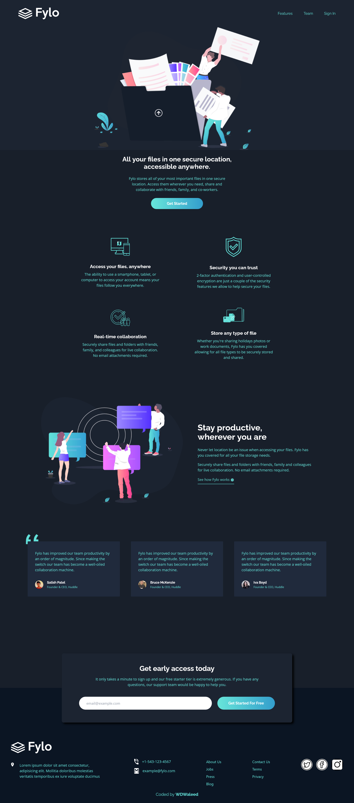

# Frontend Mentor - Fylo dark theme landing page solution

This is a solution to the [Fylo dark theme landing page challenge on Frontend Mentor](https://www.frontendmentor.io/challenges/fylo-dark-theme-landing-page-5ca5f2d21e82137ec91a50fd). Frontend Mentor challenges help you improve your coding skills by building realistic projects. 

## Table of contents

- [Overview](#overview)
  - [The challenge](#the-challenge)
  - [Screenshot](#screenshot)
  - [Links](#links)
- [My process](#my-process)
  - [Built with](#built-with)
- [Author](#author)
- [Acknowledgments](#acknowledgments)

## Overview

### The challenge

Users should be able to:

- View the optimal layout for the site depending on their device's screen size
- See hover states for all interactive elements on the page

### Screenshot

### Links

- Solution URL: [GitHub repo](https://github.com/WDWaleed/Fylo-Landing-Page-Frontend-Mentor/)
- Live Site URL: [GitHub pages](https://wdwaleed.github.io/Fylo-Landing-Page-Frontend-Mentor/)

## My process

### Built with

- Semantic HTML5 markup
- Flexbox
- Mobile-first workflow
- [React](https://reactjs.org/) - JS library
- [TailwindCSS](https://tailwindcss.com/)

## Author

- GitHub - [WDWaleed](https://github.com/WDWaleed)
- Frontend Mentor - [WDWaleed](https://www.frontendmentor.io/profile/WDWaleed)

## Acknowledgments

- [Dave Gray (My Mentor)](https://www.youtube.com/@DaveGrayTeachesCode)